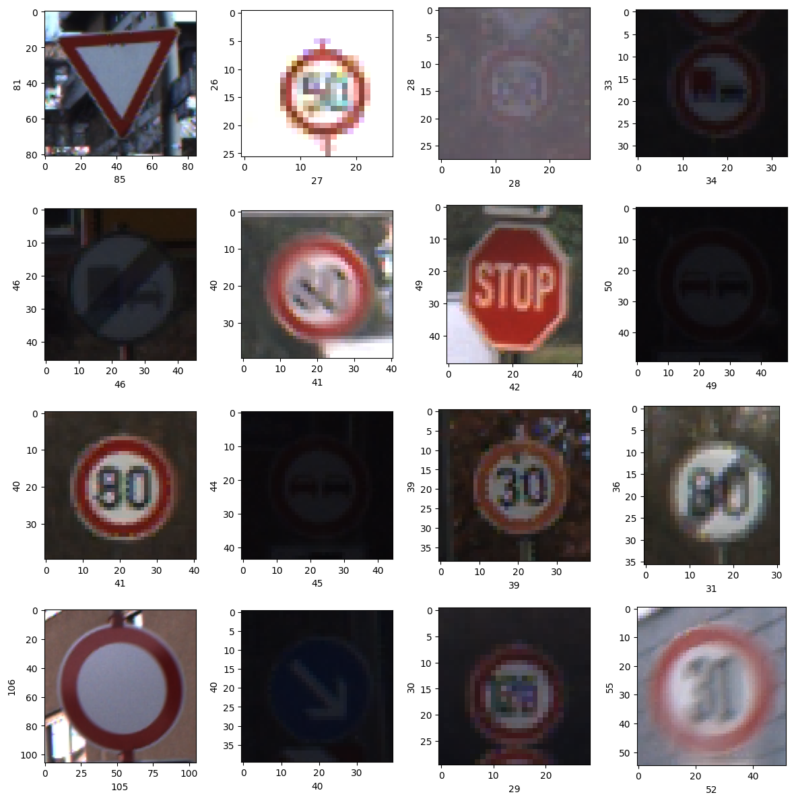
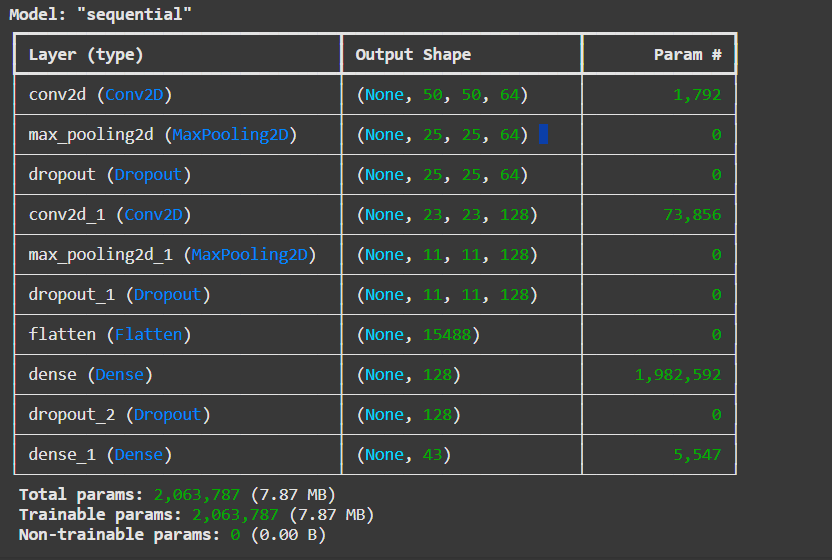
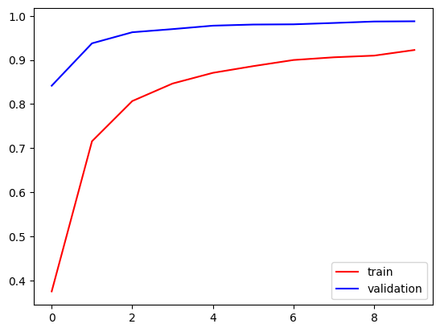
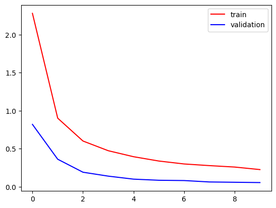
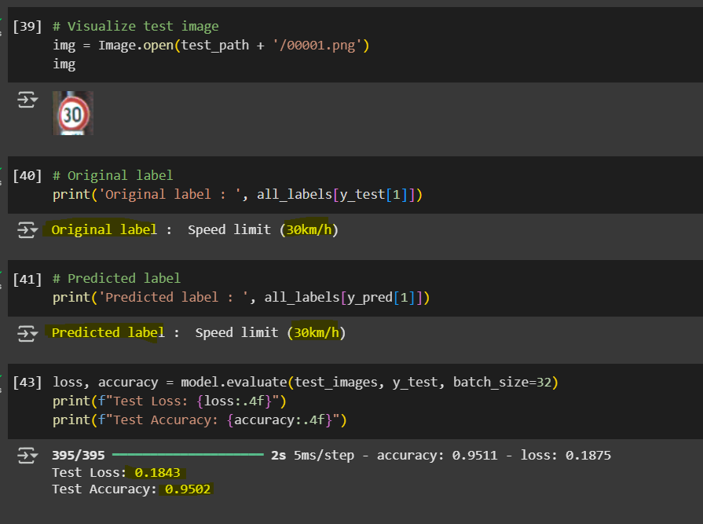

# CNN-Based Traffic Sign Classification

A deep learning project for classifying traffic signs using a Convolutional Neural Network (CNN). The implementation is provided in the notebook `TafficSignClassification.ipynb`.

---

## 1. Introduction  
This project presents a CNN model capable of recognizing various traffic signs from image data. It is designed as a part of efforts toward computer vision solutions for autonomous systems.

## 2. Problem Statement  
Reliable traffic sign recognition is essential for driver-assistance systems. This model aims to classify traffic sign images accurately and efficiently.

## 3. Dataset  
The project relies on the **German Traffic Sign Recognition Benchmark (GTSRB)** dataset—a standard benchmark for multi-class traffic sign classification. It contains over **50,000 images** spanning **43 classes**:
- **Training images**: ~39,209  
- **Test images**: ~12,630 :contentReference[oaicite:0]{index=0}

**Dataset Link**: `[https://www.kaggle.com/datasets/meowmeowmeowmeowmeow/gtsrb-german-traffic-sign]`
 

## 4. Methodology

### 4.1 Data Preprocessing  
- Load images using `tf.keras.utils.image_dataset_from_directory` or similar APIs.
- Mean dimensions of data are taken and reshaped images to mean vales.
- Normalize pixel values to [0, 1].  
- Optionally apply data augmentation (e.g., flips, rotations) to enhance generalization.

### 4.2 Model Architecture  
- Built using Keras’s `Sequential` API.  
- Layers include `Conv2D`, `MaxPooling2D`, `Flatten`, `Dropout`, and `Dense`.  
- Designed to output class probabilities via a `softmax` activation
 

### 4.3 Compilation  
- **Loss**: `sparse_categorical_crossentropy` (suitable for integer labels)  
- **Optimizer**: Adam (adaptive learning)  
- **Metric**: Accuracy  

### 4.4 Training  
- Train with `model.fit()` on training/validation sets.  
- Monitor performance and apply early stopping if needed.

### 4.5 Evaluation & Inference  
- Evaluate performance via `model.evaluate()` on the test set.  
- Generate predictions using `model.predict()` and convert probabilities to class indices with `np.argmax()`.

### 4.6 Visualization  
- Display sample images annotated with true vs. predicted labels for qualitative inspection.  
- Include training and validation accuracy and loss graphs.

---

## Result Visualizations

### Training and Validation Accuracy  

### Training and Validation Loss  

### Sample Predictions & Test Accuracy  

---

## 6. Discussion  
Expand upon aspects like:
- Model generalization and overfitting indicators  
- Misclassification trends  
- Class-wise performance (e.g., via confusion matrix)

---

## 7. Comparison with Related Work  
Similar efforts using GTSRB typically achieve **95–99% accuracy**, particularly when using advanced architectures or extensive augmentation :contentReference[oaicite:1]{index=1}.  
Variants such as LeNet, VGG, or GoogLeNet have been applied successfully in other projects :contentReference[oaicite:2]{index=2}.

---

## 8. Conclusion  
This notebook demonstrates an effective CNN pipeline for traffic sign classification—from data loading and model training to evaluation and prediction.
We started with downloading the dataset, preprocessing it, created the model and found out the predictions using the model. During preprocessing we found that this dataset has 43 classes. Model reached an accuracy of 95%+ in just 10 epochs, we can further optimize the model using hyper parameter tuning and reach a higher accuracy

---

## 9. Future Work  
Potential next steps:
- Experiment with deeper architectures (e.g., ResNet variants)  
- Incorporate additional datasets (e.g., Mapillary, GLARE) :contentReference[oaicite:3]{index=3}  
- Deploy the model on embedded systems or real-time applications

---

